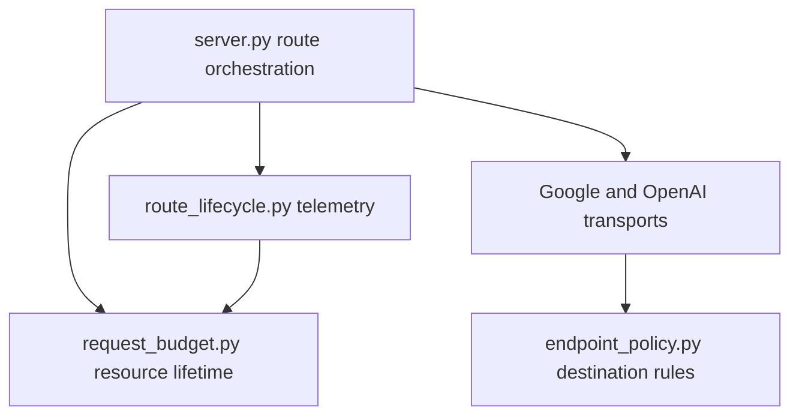

# Orchestration ownership

The gateway entrypoint chooses a route and owns its request budget/resources.
`route_lifecycle.write_route_lifecycle` owns normalization of started/terminal
telemetry, provider acceptance fields, deadline-bounded writes and authoritative
stop corrections after a delayed write. The entrypoint passes request-local
context, the current writer and redactor explicitly; the owner never imports the
server. The captured writer remains the sink for a late completion.

The shared endpoint owner prepares validation, redirect and loopback-proxy rules
before an optional final `before_open` check. Anti supplies its deadline and
admission check there, immediately before transport entry. This composes the
existing destination policy with run controls without another transport factory
or changing route implementations. HTTPX callers similarly combine existing
owned context cleanup with the endpoint owner's options.

Anti ownership is documented in its packaged [module guide](../skills/anti/OWNERSHIP.md).
Its compatibility entrypoint remains executable and exposes the existing helper
names. The source collector coordinates Git and repository policy; captured-byte
rendering and coverage aggregation have a separate owner. This is incremental:
CLI compatibility bindings and small useful helpers remain where callers need
them. There is no new provider registry, plugin framework, orchestration class or
public HTTP/CLI contract.

Verification uses the existing terminal/telemetry, request deadline, payload,
coverage, policy, persistence and interrupted-publication fixtures. Owned-module
imports are checked in a fresh isolated process without either entrypoint.
Installed wheel/rebuilt-sdist and standalone skill checks exercise the same
modules. Module boundaries reduce entrypoint responsibilities; they do not imply
faster requests or new live-provider support.
