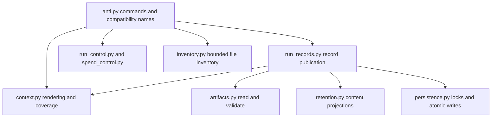

# Anti module ownership

`anti.py` remains the executable CLI and compatibility import surface. It owns
command/workflow expansion, generation scheduling and command-level signal
handling. Cohesive implementations use direct owned functions rather than
importing this entry script back into helper modules.

- `context.py` owns captured-byte decoding, whole-file prompt assembly and the
  shared coverage projection used by live output and saved artifacts. It does not
  choose models, consult providers or import the CLI. `collect_review_context` in
  the entrypoint still coordinates Git selection and policy checks before handing
  captured data to rendering/coverage functions.
- `run_records.py` owns retention compatibility checks, immutable result/lane
  publication, index replacement and record-path resolution. The command layer
  holds the run lock, captures identity/time/helper/policy metadata and supplies
  the existing atomic writer. Artifacts publish before the index; a failed index
  replacement keeps the last committed revision authoritative. The injected write
  primitive preserves existing caller fault-injection and compatibility behavior.
- `artifacts.py` remains the reader/schema authority; `persistence.py` owns the
  filesystem primitives and `retention.py` owns content projection. The shared
  `errors.py` exception avoids an import back into the CLI. `runner.py` remains a
  small useful presentation boundary because callers still need it.

Existing `anti.coverage_summary`, prompt helpers, `AntiError`, record functions
and constants remain importable through direct exports or small compatibility
adapters. Dynamic run roots, the caller's atomic-write hook and the entrypoint's effective
file-byte cap still flow through
those adapters. They do not duplicate the owned implementation.

## Combining controls with retention

Never-mode retains only allowlisted numeric lifecycle/control counters and fixed
labels. It does not regain lane/model details, event histories, pricing sources,
gateway addresses or output merely because run/admission controls are present.
It can retain a pricing declaration hash and currency code, not the declaration
contents. Summary-mode reserves those bounded counters independently of content
preview limits, so large earlier payloads cannot erase deferred/judge/consult/admission
counts and retry disposition. Detailed judge identity/output evidence remains available in full mode;
live JSON is independent of persistence projection.

The package manifest includes each owner and this document; no personal installed
skill is changed by source edits. Existing golden payload, coverage, record and
fault-injection tests plus isolated imports and installed artifacts check the
boundaries. Fewer entrypoint lines are a maintainability measure, not a speed or
billing claim.
